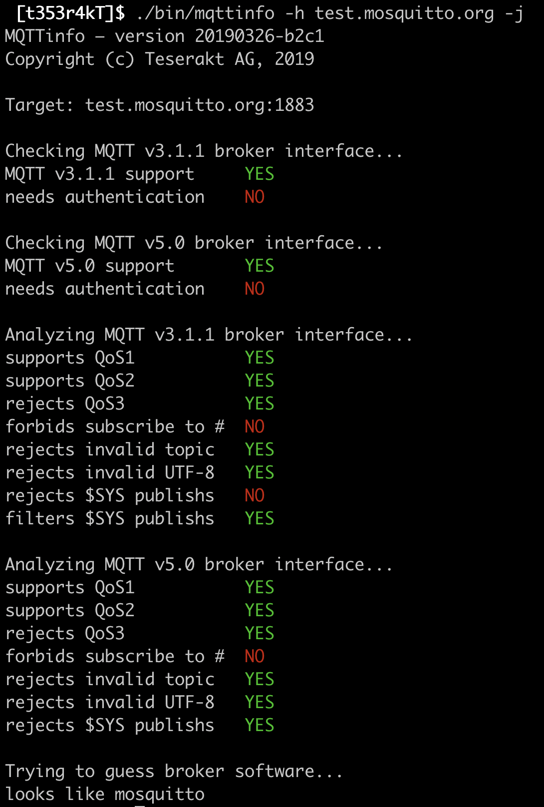

# mqttinfo

mqttinfo is a command-line utility to retrieve information on an MQTT broker.

Usage:

```
./bin/mqttinfo --help
      --help          shows this
  -h, --host string   MQTT broker to connect to (default "localhost")
  -j, --json          writes JSON-formatted output to mqttinfo.json
  -p, --port int      network port to connect to (default 1883)
  -P, --pwd string    password, if authentication is needed
  -u, --user string   username, if authentication is needed
```

Key features of mqttinfo:

* **MQTT v3.1.1 and v5.0 support** 
* **Multiplatform**: Will run on Linux, macOS, Windows.
* **Broker fingerprinting**: Attempts to identify the broker product.
* **Human- and machine-readable output**: Prints results to stdout and writes JSON to a file. 

Current limitations:

* TLS is not supported yet.
* WebSocket is not supported yet.
* Only HiveMQ, mosquitto, and VerneMQ are identified as brokers.
* Broker fingerprinting is pretty dumb, can be enhanced for example by
  looking at reason strings.

To analyze a remote broker, you can for example do the following:

 

Please note that the last step (product detection) may take up to a
minute, because it's awaiting for the publication of messages from the
$SYS tree.

## Disclaimers

The behavior of a broker depends on several factors: the broker product,
the version of the software, the parameters defined in the configuration
file, and the MQTT version.
It's therefore unwise to conclude that broker product X is "better" than
broker product "Y" after you've observed that some instance of X looks
better than some instance of Y.

mqttinfo doesn't perform any intrusive operations but can be seen as a
reconnaissance tool in an offensive context, and in the worst case it
could crash particularly fragile brokers. 
So use at your own risk, note that we decline any responsibility etc.
etc.

Broker detection is based on heuristics, and therefore is not 100% reliable.
Please feel free to file an issue in GitHub if you encounter
misidentified brokers, we'll do our best to improve mqttinfo's detection
capabilities.


## Intellectual property

mqttinfo is copyright (c) 2019, Teserakt AG.

The code is released under AGPLv2, please [contact us](mailto:contact@teserakt.io) if that's an issue for you.
